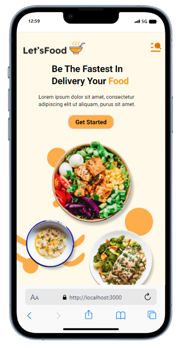

## Projeto

### Visualizar projeto 😁👉 [lest_food](https://lest-food.vercel.app/)

<p style="font-size:16px;padding:0px 25px 10px">
    Projeto: para mostrar cardapio de um restaurante fest Food, 
    com varias opções incluido tipos de serviços, com area de feedback e contato.
</p>
<p style="font-size:18px;padding:0px 25px 10px">Stack. React/Next.js 13.5, typescript, Tailwind, Swiper, figman da comunidade 
</p>
<br>
<p style="font-size:14px;padding:0px 25px 10px">
    Figman da propria comunidade utilizado, para aprimorar meus conhecimentos em Next, reutilização de components, Tailwind, metodo e funções do proprio javaScript e React 
</p>


<div style="display:flex;justify-content:center"></div>

First, run the development server:

```bash
npm run dev
# or
yarn dev
# or
pnpm dev
```

Open [http://localhost:3000](http://localhost:3000) with your browser to see the result.

## Learn More
